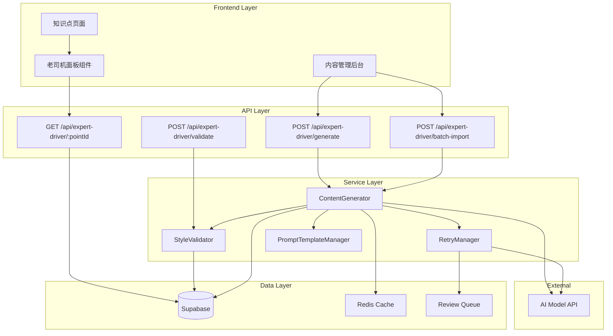

# Design Document: 老司机带路 (Expert Driver Mode)

## Overview

老司机带路功能是一个AI驱动的内容生成和管理系统，为执业药师考试题库提供专业且有趣的知识点解析。系统采用标准化的Prompt模板确保内容风格一致，通过自动重试和风格检查机制保证内容质量，支持批量生成和版本管理。

核心设计原则：
1. **风格一致性** - 通过统一Prompt模板和风格检查确保所有内容保持"老司机"语气
2. **可扩展性** - 支持多种内容变体（完整版、精简版、移动端版）
3. **可追溯性** - 保留原始知识点和Prompt版本信息
4. **容错性** - 自动重试机制和人工审核队列处理异常情况

## Architecture



## Components and Interfaces

### 1. ExpertDriverContent (数据模型)

```typescript
interface ExpertDriverContent {
  id: string;
  knowledge_point_id: string;
  考点名称: string;
  坑位解析: TrapAnalysis[];
  应试战术: string[];
  押题预测: PredictionQuestion[];
  终极思维导图: string;
  一句话极速总结: string;
  short_summary?: string;
  version: string;
  style_variant: StyleVariant;
  source_knowledge_point_text: string;
  prompt_template_version: string;
  style_check: StyleCheckResult;
  created_at: Date;
  updated_at: Date;
}

interface TrapAnalysis {
  标题: string;
  出题套路: string;
  坑在哪里: string[];
  老司机技巧: string;
  口诀?: string;
  场景化记忆?: string;
}

interface PredictionQuestion {
  题干: string;
  正确答案: string;
  理由: string;
}

type StyleVariant = 'default' | 'compact' | 'mobile' | 'video_script';

interface StyleCheckResult {
  is_driver_tone: boolean;
  has_traps: boolean;
  has_mnemonic: boolean;
  no_ai_artifacts: boolean;
  no_forbidden_patterns: boolean;
  passed: boolean;
  failure_reasons?: string[];
}
```

### 2. PromptTemplateManager

```typescript
interface PromptTemplate {
  version: string;
  system_prompt: string;
  user_prompt_template: string;
  json_schema: object;
  forbidden_patterns: string[];
  style_rules: StyleRule[];
}

interface StyleRule {
  name: string;
  pattern: RegExp;
  type: 'required' | 'forbidden';
  message: string;
}

class PromptTemplateManager {
  getCurrentTemplate(): PromptTemplate;
  getTemplateByVersion(version: string): PromptTemplate;
  validateOutput(content: ExpertDriverContent): ValidationResult;
}
```

### 3. ContentGenerator

```typescript
interface GenerationRequest {
  knowledge_point_id: string;
  knowledge_point_text: string;
  style_variant?: StyleVariant;
}

interface GenerationResult {
  success: boolean;
  content?: ExpertDriverContent;
  error?: string;
  retry_count: number;
  style_check: StyleCheckResult;
}

class ContentGenerator {
  generate(request: GenerationRequest): Promise<GenerationResult>;
  generateBatch(requests: GenerationRequest[]): Promise<BatchResult>;
}
```

### 4. StyleValidator

```typescript
interface ValidationResult {
  valid: boolean;
  style_check: StyleCheckResult;
  schema_errors?: string[];
  style_errors?: string[];
}

class StyleValidator {
  validateSchema(content: unknown): boolean;
  validateStyle(content: ExpertDriverContent): StyleCheckResult;
  checkForbiddenPatterns(text: string): string[];
  validateTrapAnalysis(trap: TrapAnalysis): string[];
}
```

### 5. RetryManager

```typescript
interface RetryConfig {
  min_retries: number;  // 2
  max_retries: number;  // 5
  retry_delay_ms: number;
}

interface RetryResult {
  success: boolean;
  content?: ExpertDriverContent;
  attempts: RetryAttempt[];
  sent_to_review_queue: boolean;
}

interface RetryAttempt {
  attempt_number: number;
  error_type: 'schema' | 'style' | 'length' | 'missing_fields';
  error_details: string;
  timestamp: Date;
}

class RetryManager {
  executeWithRetry(
    generator: () => Promise<ExpertDriverContent>,
    validator: StyleValidator
  ): Promise<RetryResult>;
  
  addToReviewQueue(
    request: GenerationRequest,
    attempts: RetryAttempt[]
  ): Promise<void>;
}
```

## Data Models

### Database Schema

```sql
-- 老司机内容表
CREATE TABLE expert_driver_content (
  id UUID PRIMARY KEY DEFAULT gen_random_uuid(),
  knowledge_point_id UUID NOT NULL REFERENCES knowledge_points(id),
  content JSONB NOT NULL,
  version VARCHAR(10) NOT NULL DEFAULT 'v1.0',
  style_variant VARCHAR(20) NOT NULL DEFAULT 'default',
  source_knowledge_point_text TEXT NOT NULL,
  prompt_template_version VARCHAR(10) NOT NULL,
  style_check JSONB NOT NULL,
  created_at TIMESTAMP WITH TIME ZONE DEFAULT NOW(),
  updated_at TIMESTAMP WITH TIME ZONE DEFAULT NOW(),
  UNIQUE(knowledge_point_id, style_variant)
);

-- Prompt模板表
CREATE TABLE prompt_templates (
  id UUID PRIMARY KEY DEFAULT gen_random_uuid(),
  version VARCHAR(10) NOT NULL UNIQUE,
  system_prompt TEXT NOT NULL,
  user_prompt_template TEXT NOT NULL,
  json_schema JSONB NOT NULL,
  forbidden_patterns TEXT[] NOT NULL,
  style_rules JSONB NOT NULL,
  is_active BOOLEAN DEFAULT false,
  created_at TIMESTAMP WITH TIME ZONE DEFAULT NOW()
);

-- 人工审核队列表
CREATE TABLE review_queue (
  id UUID PRIMARY KEY DEFAULT gen_random_uuid(),
  knowledge_point_id UUID NOT NULL,
  knowledge_point_text TEXT NOT NULL,
  style_variant VARCHAR(20) NOT NULL,
  retry_attempts JSONB NOT NULL,
  status VARCHAR(20) DEFAULT 'pending',
  reviewer_notes TEXT,
  created_at TIMESTAMP WITH TIME ZONE DEFAULT NOW(),
  reviewed_at TIMESTAMP WITH TIME ZONE
);

-- 索引
CREATE INDEX idx_expert_driver_point_id ON expert_driver_content(knowledge_point_id);
CREATE INDEX idx_expert_driver_variant ON expert_driver_content(style_variant);
CREATE INDEX idx_review_queue_status ON review_queue(status);
```

### JSON Content Schema

```json
{
  "$schema": "http://json-schema.org/draft-07/schema#",
  "type": "object",
  "required": ["考点名称", "坑位解析", "应试战术", "押题预测", "终极思维导图", "一句话极速总结"],
  "properties": {
    "考点名称": { "type": "string", "minLength": 1 },
    "坑位解析": {
      "type": "array",
      "minItems": 3,
      "maxItems": 6,
      "items": {
        "type": "object",
        "required": ["标题", "出题套路", "坑在哪里", "老司机技巧"],
        "properties": {
          "标题": { "type": "string", "maxLength": 50 },
          "出题套路": { "type": "string", "maxLength": 200 },
          "坑在哪里": { "type": "array", "items": { "type": "string" }, "minItems": 1 },
          "老司机技巧": { "type": "string", "maxLength": 150 },
          "口诀": { "type": "string", "maxLength": 100 },
          "场景化记忆": { "type": "string", "maxLength": 200 }
        }
      }
    },
    "应试战术": {
      "type": "array",
      "minItems": 2,
      "maxItems": 5,
      "items": { "type": "string", "maxLength": 100 }
    },
    "押题预测": {
      "type": "array",
      "minItems": 2,
      "maxItems": 4,
      "items": {
        "type": "object",
        "required": ["题干", "正确答案", "理由"],
        "properties": {
          "题干": { "type": "string" },
          "正确答案": { "type": "string" },
          "理由": { "type": "string", "maxLength": 150 }
        }
      }
    },
    "终极思维导图": { "type": "string" },
    "一句话极速总结": { "type": "string", "minLength": 10, "maxLength": 20 },
    "short_summary": { "type": "string", "maxLength": 50 }
  }
}
```


## Correctness Properties

*A property is a characteristic or behavior that should hold true across all valid executions of a system-essentially, a formal statement about what the system should do. Properties serve as the bridge between human-readable specifications and machine-verifiable correctness guarantees.*

Based on the prework analysis, the following correctness properties have been identified after eliminating redundancies:

### Property 1: Schema Validation Completeness
*For any* ExpertDriverContent object, the JSON schema validation SHALL correctly accept objects with all required fields (考点名称, 坑位解析, 应试战术, 押题预测, 终极思维导图, 一句话极速总结, version, style_variant, source_knowledge_point_text) and reject objects missing any required field.
**Validates: Requirements 1.1, 1.7**

### Property 2: Trap Analysis Array Bounds
*For any* 坑位解析 array, the validation SHALL accept arrays with 3-6 items where each item contains required fields (标题, 出题套路, 坑在哪里, 老司机技巧) and at least one of (口诀, 场景化记忆), and reject arrays outside this range or missing required fields.
**Validates: Requirements 1.2, 7.1, 7.3**

### Property 3: Prediction Questions Array Bounds
*For any* 押题预测 array, the validation SHALL accept arrays with 2-4 items where each item contains (题干, 正确答案, 理由), and reject arrays outside this range.
**Validates: Requirements 1.3, 7.2**

### Property 4: Summary Length Constraint
*For any* 一句话极速总结 string, the validation SHALL accept strings with 10-20 characters and reject strings outside this range.
**Validates: Requirements 1.4**

### Property 5: Version Format Validation
*For any* version string, the validation SHALL accept strings matching pattern "vX.Y" (where X and Y are integers) and reject non-conforming strings.
**Validates: Requirements 1.5**

### Property 6: Style Variant Enum Validation
*For any* style_variant value, the validation SHALL accept only values in {"default", "compact", "mobile", "video_script"} and reject all other values.
**Validates: Requirements 1.6**

### Property 7: Short Summary Length Constraint
*For any* short_summary string (when present), the validation SHALL accept strings with at most 50 characters and reject longer strings.
**Validates: Requirements 1.8**

### Property 8: Content Generation Schema Conformance
*For any* knowledge point text input, the generated ExpertDriverContent SHALL conform to the complete JSON schema specification.
**Validates: Requirements 2.1**

### Property 9: Mnemonic Line Count Constraint
*For any* 口诀 field in generated content, the text SHALL contain at most 3 lines (2 or fewer newline characters).
**Validates: Requirements 2.4, 9.4**

### Property 10: Trap Analysis Character Limit
*For any* 坑位解析 item in generated content, the combined text length SHALL not exceed 300 characters.
**Validates: Requirements 2.6, 11.2**

### Property 11: Forbidden Pattern Detection
*For any* generated content text, the validation SHALL detect and reject content containing forbidden patterns: "AI觉得", "可能", "本模型", "首先", "其次", "总之", "综上所述".
**Validates: Requirements 2.7, 9.5, 11.3**

### Property 12: Storage Upsert Behavior
*For any* knowledge point ID and style variant combination, saving content twice SHALL result in exactly one record in the database with the latest content.
**Validates: Requirements 3.1, 3.2**

### Property 13: Pre-Save Validation
*For any* content submission, invalid content SHALL be rejected before database persistence, and valid content SHALL be successfully stored.
**Validates: Requirements 3.3**

### Property 14: API Response Format
*For any* GET request with a knowledge point ID, the API SHALL return either a complete ExpertDriverContent JSON or an empty response (not partial data).
**Validates: Requirements 5.1**

### Property 15: API Validation Error Messages
*For any* POST request with invalid content, the API SHALL return error messages that identify all failing validation rules.
**Validates: Requirements 5.2, 5.3**

### Property 16: Batch Import Partial Failure Handling
*For any* batch import with mixed valid and invalid items, the system SHALL process all valid items, report individual failures, and provide a complete summary.
**Validates: Requirements 6.1, 6.2, 6.3, 10.7**

### Property 17: Prompt Template Version Tracking
*For any* generated content, the stored prompt_template_version SHALL match the version of the template used during generation.
**Validates: Requirements 8.5**

### Property 18: Template Version Increment
*For any* prompt template update, the new version number SHALL be greater than the previous version.
**Validates: Requirements 8.6**

### Property 19: Style Check Object Generation
*For any* content validation, the system SHALL produce a style_check object with all required fields (is_driver_tone, has_traps, has_mnemonic, no_ai_artifacts, no_forbidden_patterns, passed).
**Validates: Requirements 9.2, 9.3, 9.6**

### Property 20: Failed Style Check Queue Insertion
*For any* content that fails style compliance check, the system SHALL add it to the manual review queue with failure reasons.
**Validates: Requirements 9.7**

### Property 21: Retry Count Bounds
*For any* generation that fails validation, the retry mechanism SHALL attempt between 2 and 5 retries before giving up.
**Validates: Requirements 10.1, 10.2**

### Property 22: Max Retry Queue Insertion
*For any* generation that fails all retry attempts, the system SHALL add the request to the manual review queue.
**Validates: Requirements 10.3**

### Property 23: Retry Trigger Conditions
*For any* AI output that violates schema, exceeds length limits, or misses required fields, the system SHALL trigger a retry.
**Validates: Requirements 10.4, 10.5, 11.6**

### Property 24: Retry Attempt Logging
*For any* retry attempt, the system SHALL log the attempt number, error type, error details, and timestamp.
**Validates: Requirements 10.6**

## Error Handling

### Validation Errors

| Error Type | Handling Strategy | User Message |
|------------|-------------------|--------------|
| Schema validation failure | Return detailed field errors | "内容格式不正确：{field} {reason}" |
| Array bounds violation | Return specific bounds error | "坑位解析数量必须在3-6个之间" |
| Character limit exceeded | Return field and limit | "一句话极速总结超过20字符限制" |
| Forbidden pattern detected | Return pattern and location | "检测到禁止表达：{pattern}" |
| Missing required field | Return field name | "缺少必填字段：{field}" |

### Generation Errors

| Error Type | Handling Strategy | Recovery Action |
|------------|-------------------|-----------------|
| AI API timeout | Retry with exponential backoff | Max 3 retries, then queue |
| Invalid JSON response | Parse error, retry | Retry with stricter prompt |
| Schema non-conformance | Validate and retry | Retry with explicit schema |
| Style check failure | Log and retry | Retry with style emphasis |
| Max retries exceeded | Add to review queue | Notify admin |

### Database Errors

| Error Type | Handling Strategy | Recovery Action |
|------------|-------------------|-----------------|
| Connection failure | Retry with backoff | Max 3 retries |
| Constraint violation | Return specific error | Log and notify |
| Transaction failure | Rollback and retry | Max 2 retries |

## Testing Strategy

### Property-Based Testing Library

This project will use **fast-check** for property-based testing in TypeScript/JavaScript.

### Unit Tests

Unit tests will cover:
- Individual validation functions (schema, style, forbidden patterns)
- Prompt template management
- Database operations (CRUD)
- API endpoint handlers

### Property-Based Tests

Each correctness property will be implemented as a property-based test using fast-check. Tests will be annotated with the property number and requirements reference.

**Test Configuration:**
- Minimum 100 iterations per property test
- Seed logging for reproducibility
- Shrinking enabled for minimal failing examples

**Generator Strategy:**
- Custom generators for ExpertDriverContent objects
- Generators for valid/invalid trap analysis arrays
- Generators for version strings (valid and invalid formats)
- Generators for text with/without forbidden patterns

### Test File Structure

```
lib/
  expert-driver/
    schema-validator.ts
    schema-validator.test.ts      # Unit tests
    schema-validator.property.ts  # Property tests
    style-validator.ts
    style-validator.test.ts
    style-validator.property.ts
    content-generator.ts
    content-generator.test.ts
    retry-manager.ts
    retry-manager.test.ts
    retry-manager.property.ts
```

### Property Test Annotation Format

```typescript
/**
 * **Feature: expert-driver-mode, Property 2: Trap Analysis Array Bounds**
 * **Validates: Requirements 1.2, 7.1, 7.3**
 */
test('trap analysis array accepts 3-6 items with required fields', () => {
  fc.assert(
    fc.property(trapAnalysisArrayArb, (traps) => {
      // Test implementation
    }),
    { numRuns: 100 }
  );
});
```

